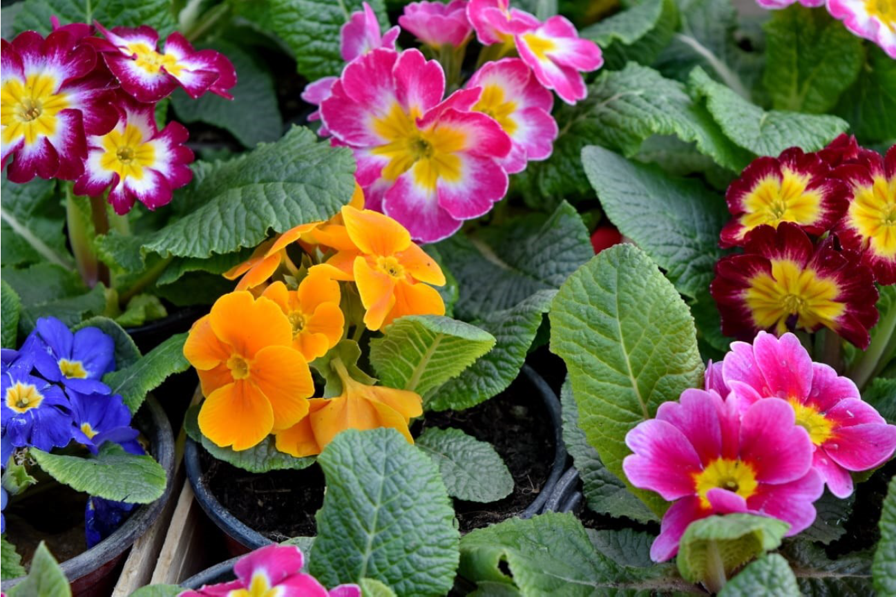

<!-- README.md is generated from README.Rmd. Please edit that file -->

```{r, include = FALSE}
knitr::opts_chunk$set(
  collapse = TRUE,
  comment = "#>",
  fig.path = "man/figures/README-",
  out.width = "100%"
)
```

# nic

<!-- badges: start -->
<!-- badges: end -->

## Nature Inspired Colour Palette.

## Installation

You can install the released version of nic from [Github](https://github.com/thiyangt/nic) with:

```{r}
#devtools::install_github("thiyangt/nic")
library(nic)
```

## Example

This is a basic example which shows you how to solve a common problem:

```{r}
library(nic)
## basic example code
library(palmerpenguins)
library(tidyverse)
ggplot(data = penguins, 
       aes(x = flipper_length_mm,
           y = body_mass_g)) +
  geom_point(aes(color = species, 
                 shape = species),
             size = 3) +
  scale_color_manual(values = nic_palette("colleasb",3)) +
  labs(title = "Penguin size, Palmer Station LTER",
       subtitle = "Flipper length and body mass for Adelie, Chinstrap and Gentoo Penguins",
       x = "Flipper length (mm)",
       y = "Body mass (g)",
       color = "Penguin species",
       shape = "Penguin species") 
```

```{r}
pal=nic_palette("colleasb",3)
ggplot(data.frame(x = rnorm(1e4), y = rnorm(1e4)), aes(x = x, y = y)) +
  geom_hex() +
  coord_fixed() +
  scale_fill_gradientn(colours = pal) + ggtitle("colleasb")
  
```

```{r}
pal <- nic_palette("colleasb",2)
penguins2 <- penguins %>% drop_na()
ggplot(data = penguins2, 
       aes(y = flipper_length_mm,
           x = sex,
           fill=sex)) +
  geom_boxplot() +
  scale_fill_manual(values = pal) + ggtitle("colleasa")
  
```




```{r}
pal <- nic_palette("thiruni", 5)
library(ggplot2)
data(diamonds)
ggplot(data = diamonds, 
       aes(y = carat,
           x= cut,
           fill=cut)) +
  geom_boxplot() +
  scale_fill_manual(values = pal) + ggtitle("Thinuri")
  
```


