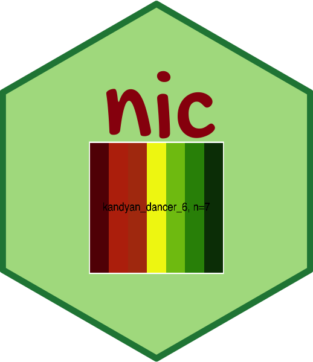

# nic 

<!-- README.md is generated from README.Rmd. Please edit that file -->

```{r, include = FALSE}
knitr::opts_chunk$set(
  collapse = TRUE,
  comment = "#>",
  fig.path = "man/figures/README-",
  out.width = "100%"
)
```


<!-- badges: start -->
<!-- badges: end -->

## Sri Lanka Nature Inspired Colour Palettes

## Installation

You can install the released version of nic from [Github](https://github.com/thiyangt/nic) with:

```{r, warning=FALSE, message=FALSE}
#devtools::install_github("thiyangt/nic")
library(nic)
library(tidyverse)
```

## Example

This is a basic example which shows you how to solve a common problem:

```{r}
library(patchwork)
library(here)
orchid_image <- ggplot() + annotation_custom(grid::rasterGrob(
  magick::image_read(here("data-raw","orchid.jpeg")),
  width=unit(1,"npc"),
  height=unit(1,"npc")),
  -Inf, Inf, -Inf, Inf)

orchid_pal = nic_palette("orchid_12",12)
ixora_pal = nic_palette("ixora_12",12)

ixora_image <- ggplot() + annotation_custom(grid::rasterGrob(
  magick::image_read(here("data-raw","ixora.jpeg")),
  width=unit(1,"npc"),
  height=unit(1,"npc")),
  -Inf, Inf, -Inf, Inf)

orchid_plot <- ggplot(data.frame(x = rnorm(1e4), y = rnorm(1e4)), aes(x = x, y = y)) +
  geom_hex() +
  coord_fixed() +
  scale_fill_gradientn(colours = orchid_pal) + 
  ggtitle("Orchid flower") +
  theme_minimal()+
  theme(legend.position = "bottom")
ixora_plot <- ggplot(data.frame(x = rnorm(1e4), y = rnorm(1e4)), aes(x = x, y = y)) +
  geom_hex() +
  coord_fixed() +
  scale_fill_gradientn(colours = ixora_pal) + 
  ggtitle("Ixora flower") +
  theme_minimal()+
  theme(legend.position = "bottom")
orchid_image + ixora_image + orchid_plot + ixora_plot
```

```{r}
moss_rose_1_image <- ggplot() + annotation_custom(grid::rasterGrob(
  magick::image_read(here("data-raw","moss_rose_1.jpeg")),
  width=unit(1,"npc"),
  height=unit(1,"npc")),
  -Inf, Inf, -Inf, Inf)
moss_rose_2_image <- ggplot() + annotation_custom(grid::rasterGrob(
  magick::image_read(here("data-raw","moss_rose_2.jpeg")),
  width=unit(1,"npc"),
  height=unit(1,"npc")),
  -Inf, Inf, -Inf, Inf)
moss_rose_3_image <- ggplot() + annotation_custom(grid::rasterGrob(
  magick::image_read(here("data-raw","moss_rose_3.jpeg")),
  width=unit(1,"npc"),
  height=unit(1,"npc")),
  -Inf, Inf, -Inf, Inf)

mean_vecs <- sample(seq(5))
sd_vecs <- sample(seq(5))

moss_rose_plot <- ggplot(data.frame(y = c(rnorm(1000,mean=mean_vecs,sd=sd_vecs)),x = sample(LETTERS[1:5],1000,replace=TRUE)),aes(x = x,y = y,fill = x)) + 
  geom_boxplot() + 
  theme_minimal() +
  scale_fill_manual(values = nic_palette("moss_rose_5")) +
  theme(legend.position = "none")
(moss_rose_1_image + moss_rose_2_image + moss_rose_3_image) / moss_rose_plot
```


```{r}
library(palmerpenguins)
coleus_density_img <- ggplot() + annotation_custom(grid::rasterGrob(
  magick::image_read(here("data-raw","coleus_density.PNG")),
  width=unit(1,"npc"),
  height=unit(2,"npc")),
  -Inf, Inf, -Inf, Inf)

coleus_density = nic_palette("coleus_density_7",7)
coleus_density_plot <- ggplot(data.frame(x = rnorm(1e4), y = rnorm(1e4)), aes(x = x, y = y)) + geom_hex() +
  coord_fixed() +
  scale_fill_gradientn(colours = coleus_density) + ggtitle("coleus_density_7")

coleus1a <- ggplot() + annotation_custom(grid::rasterGrob(
  magick::image_read(here("data-raw","coleus1a.jpg")),
  width=unit(1,"npc"),
  height=unit(2,"npc")),
  -Inf, Inf, -Inf, Inf)

pal <- nic_palette("coleusa_2",2)
penguins2 <- penguins %>% drop_na()
penguinplot <- ggplot(data = penguins2, 
       aes(y = flipper_length_mm,
           x = sex,
           fill=sex)) +
  geom_boxplot() +
  scale_fill_manual(values = pal) + ggtitle("colleasa_2")

(coleus_density_img + coleus_density_plot + coleus1a + penguinplot)
```

```{r, fig.width=12}
#devtools::install_github("edwinth/paletti")
library(paletti)
statesMap = map_data("state")
statesMap$num = rnorm(nrow(statesMap))

kandyan <- knitr::include_graphics(here("data-raw","kandyan_dancer.png"))
kandyan <- ggplot() + annotation_custom(grid::rasterGrob(
  magick::image_read(here("data-raw","kandyan_dancer.png")),
  width=unit(1,"npc"),
  height=unit(1,"npc")),
  -Inf, Inf, -Inf, Inf)

pal_kandyan <- nic_palette("kandyan_dancer_6",6)
scale_fill_my_palette <- get_pal(pal_kandyan) %>%
  get_scale_fill()
g2 <- ggplot(statesMap, aes(x = long, y = lat, group = group, fill = num)) + 
geom_polygon(color = "black") + scale_fill_my_palette(discrete = FALSE)
(kandyan + g2)
```

## Other colour pallets

```{r}

nic_palette("applecroton_2", 2)
knitr::include_graphics(here("data-raw","coleus1b.JPG"))
nic_palette("coleusb_3", 3)
knitr::include_graphics(here("data-raw","wishbone.jpg"))
nic_palette("wishbone_3", 3)
knitr::include_graphics(here("data-raw","buttercup.jpeg"))
nic_palette("buttercup_12", 12)
nic_palette("buttercup_8", 8)
knitr::include_graphics(here("data-raw","ixora.jpeg"))
nic_palette("ixora_12", 12)
nic_palette("ixora_8", 8)
knitr::include_graphics(here("data-raw","moss_rose_4.jpeg"))
nic_palette("moss_rose_5", 5)
knitr::include_graphics(here("data-raw","orchid.jpeg"))
nic_palette("orchid_12", 12)
nic_palette("orchid_8", 8)
knitr::include_graphics(here("data-raw","squarestem.jpeg"))
nic_palette("squarestem_5", 5)
knitr::include_graphics(here("data-raw","papaya.jpeg"))
nic_palette("papaya_11", 11)


```
