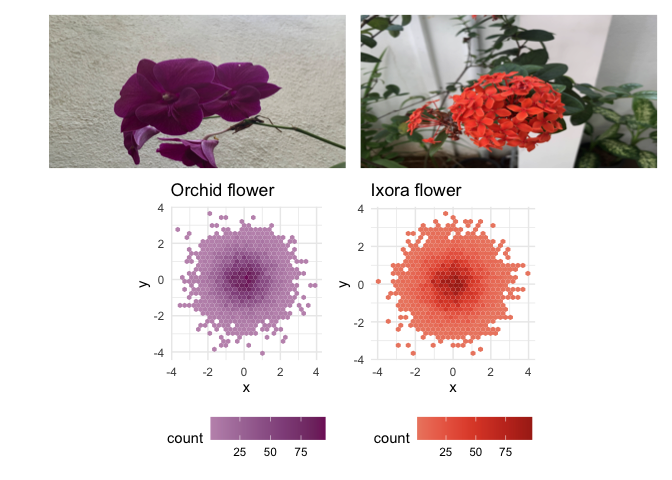
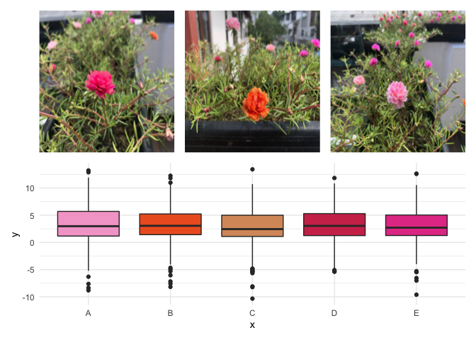

<!-- README.md is generated from README.Rmd. Please edit that file -->

# nic

<!-- badges: start -->
<!-- badges: end -->

## Nature Inspired Colour Palette.

## Installation

You can install the released version of nic from
[Github](https://github.com/thiyangt/nic) with:

``` r
#devtools::install_github("thiyangt/nic")
library(nic)
```

## Example

This is a basic example which shows you how to solve a common problem:


``` r
library(nic)
## basic example code
library(palmerpenguins)
#> Warning: package 'palmerpenguins' was built under R version 3.6.2
library(tidyverse)
#> Warning: package 'tidyverse' was built under R version 3.6.2
#> ── Attaching packages ─────────────────────────────────────── tidyverse 1.3.1 ──
#> ✓ ggplot2 3.3.5     ✓ purrr   0.3.4
#> ✓ tibble  3.1.2     ✓ dplyr   1.0.7
#> ✓ tidyr   1.1.3     ✓ stringr 1.4.0
#> ✓ readr   1.4.0     ✓ forcats 0.5.1
#> Warning: package 'ggplot2' was built under R version 3.6.2
#> Warning: package 'tibble' was built under R version 3.6.2
#> Warning: package 'tidyr' was built under R version 3.6.2
#> Warning: package 'readr' was built under R version 3.6.2
#> Warning: package 'purrr' was built under R version 3.6.2
#> Warning: package 'dplyr' was built under R version 3.6.2
#> Warning: package 'forcats' was built under R version 3.6.2
#> ── Conflicts ────────────────────────────────────────── tidyverse_conflicts() ──
#> x dplyr::filter() masks stats::filter()
#> x dplyr::lag()    masks stats::lag()
ggplot(data = penguins, 
       aes(x = flipper_length_mm,
           y = body_mass_g)) +
  geom_point(aes(color = species, 
                 shape = species),
             size = 3) +
  scale_color_manual(values = nic_palette("colleasb",3)) +
  labs(title = "Penguin size, Palmer Station LTER",
       subtitle = "Flipper length and body mass for Adelie, Chinstrap and Gentoo Penguins",
       x = "Flipper length (mm)",
       y = "Body mass (g)",
       color = "Penguin species",
       shape = "Penguin species") 
#> Warning: Removed 2 rows containing missing values (geom_point).
```


``` r
pal=nic_palette("colleasb",3)
ggplot(data.frame(x = rnorm(1e4), y = rnorm(1e4)), aes(x = x, y = y)) +
  geom_hex() +
  coord_fixed() +
  scale_fill_gradientn(colours = pal) + ggtitle("colleasb")
```


``` r
pal <- nic_palette("colleasa",2)
penguins2 <- penguins %>% drop_na()
ggplot(data = penguins2, 
       aes(y = flipper_length_mm,
           x = sex,
           fill=sex)) +
  geom_boxplot() +
  scale_fill_manual(values = pal) + ggtitle("colleasa")
```


``` r
library(purrr)
pal <- nic_palette("wishbone",3)
penguins %>% ggplot(aes(x=species, fill=island)) + geom_bar() +
  scale_fill_manual(values = pal) + ggtitle("wishbone")
```


``` r
library(patchwork)
#> Warning: package 'patchwork' was built under R version 3.6.2
library(here)
#> here() starts at /Users/janith/Documents/R_scripts/Github_Packages/nic
orchid_image <- ggplot() + annotation_custom(grid::rasterGrob(
  magick::image_read(here("data-raw","orchid.jpeg")),
  width=unit(1,"npc"),
  height=unit(1,"npc")),
  -Inf, Inf, -Inf, Inf)

orchid_pal = nic_palette("orchid_12",12)
ixora_pal = nic_palette("ixora_12",12)

ixora_image <- ggplot() + annotation_custom(grid::rasterGrob(
  magick::image_read(here("data-raw","ixora.jpeg")),
  width=unit(1,"npc"),
  height=unit(1,"npc")),
  -Inf, Inf, -Inf, Inf)

orchid_plot <- ggplot(data.frame(x = rnorm(1e4), y = rnorm(1e4)), aes(x = x, y = y)) +
  geom_hex() +
  coord_fixed() +
  scale_fill_gradientn(colours = orchid_pal) + 
  ggtitle("Orchid flower") +
  theme_minimal()+
  theme(legend.position = "bottom")
ixora_plot <- ggplot(data.frame(x = rnorm(1e4), y = rnorm(1e4)), aes(x = x, y = y)) +
  geom_hex() +
  coord_fixed() +
  scale_fill_gradientn(colours = ixora_pal) + 
  ggtitle("Ixora flower") +
  theme_minimal()+
  theme(legend.position = "bottom")
(orchid_image + ixora_image) / (orchid_plot + ixora_plot)
```



``` r
moss_rose_1_image <- ggplot() + annotation_custom(grid::rasterGrob(
  magick::image_read(here("data-raw","moss_rose_1.jpeg")),
  width=unit(1,"npc"),
  height=unit(1,"npc")),
  -Inf, Inf, -Inf, Inf)
moss_rose_2_image <- ggplot() + annotation_custom(grid::rasterGrob(
  magick::image_read(here("data-raw","moss_rose_2.jpeg")),
  width=unit(1,"npc"),
  height=unit(1,"npc")),
  -Inf, Inf, -Inf, Inf)
moss_rose_3_image <- ggplot() + annotation_custom(grid::rasterGrob(
  magick::image_read(here("data-raw","moss_rose_3.jpeg")),
  width=unit(1,"npc"),
  height=unit(1,"npc")),
  -Inf, Inf, -Inf, Inf)

mean_vecs <- sample(seq(5))
sd_vecs <- sample(seq(5))

moss_rose_plot <- ggplot(data.frame(y = c(rnorm(1000,mean=mean_vecs,sd=sd_vecs)),x = sample(LETTERS[1:5],1000,replace=TRUE)),aes(x = x,y = y,fill = x)) + 
  geom_boxplot() + 
  theme_minimal() +
  scale_fill_manual(values = nic_palette("moss_rose")) +
  theme(legend.position = "none")
(moss_rose_1_image + moss_rose_2_image + moss_rose_3_image) / moss_rose_plot
```


